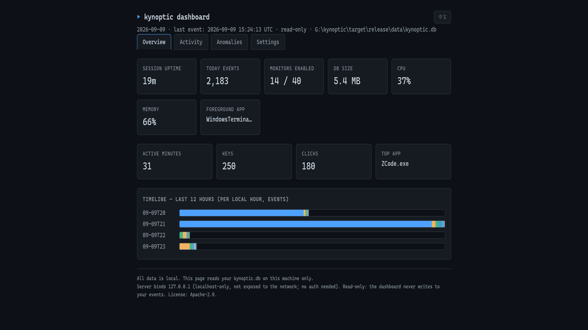

# Kynoptic

English | [简体中文](README.zh-CN.md)



A local-first activity awareness layer for Windows. Kynoptic records which
applications you use, when your machine is busy, what changes on your system —
and lets you (or your AI assistant) ask questions about it later. Everything
stays on your machine.

It answers the questions you actually have after the fact: "What was that tool
I used last Tuesday?", "Why was my laptop hot at 2pm?", "How much time did I
actually spend in the editor this week?" — through a CLI, a local dashboard,
or MCP.

  

- Website: <https://kynoptic.com>
- Status: v0.1, in active development toward a September 14 launch. API surface
  may still change.

## How it works

- **40 monitors** cover the system: foreground window and app switches,
  keyboard/mouse activity counts, idle time, battery, network interfaces,
  devices, processes, audio, brightness, Wi-Fi and more. **14 are enabled by
  default** (pure Win32 APIs, zero subprocesses); 26 more (browser tabs,
  clipboard, Bluetooth, and others) ship in the binary and are opt-in.
- **Raw events are stored untouched** in SQLite on your machine. Aggregate
  tables (per-minute/per-day buckets) exist only as derived read caches for
  fast queries; the raw layer is never truncated, re-keyed, or cleaned up
  automatically.
- **Query locally**: a CLI for ad-hoc questions, and an MCP server so a local
  AI assistant can ask for your day's summary, timeline, or anomalies without
  any data leaving the machine.

## Quick start

Requirements: Windows 10/11 and a Rust toolchain (stable, MSVC target).

```bash
git clone https://github.com/ardss/kynoptic
cd kynoptic
cargo build --release -p kynoptic-cli

# collect (background, writes to %LOCALAPPDATA%\kynoptic\kynoptic.db by default)
target\release\kynoptic.exe collect --help     # see available flags

# query what was recorded
target\release\kynoptic.exe query --from today
target\release\kynoptic.exe stats --days 7
target\release\kynoptic.exe dashboard          # local-only web panel (127.0.0.1)
```

### Use it from your AI assistant (MCP)

Kynoptic ships an MCP server (stdio JSON-RPC) with five tools:
`get_current_status`, `get_summary`, `get_timeline`, `get_anomalies`,
`wait_for`. Point your MCP client at it:

```json
{
  "mcpServers": {
    "kynoptic": { "command": "kynoptic", "args": ["mcp"] }
  }
}
```

Your assistant can then answer questions like "what was I doing when the CPU
spiked yesterday?" without the data ever leaving your disk.

## Performance

Measured on a Ryzen 5 5600X / Windows 11, reproducible from the benchmark
harness in this repo (full methodology and raw numbers in
[BENCHMARKS.md](BENCHMARKS.md)):

| Metric | Measured |
|---|---|
| Idle CPU (whole collector, default monitors) | 0.41% of one core (p95 1.56%) |
| Resident memory (steady state) | ~16.5 MB |
| Startup to first sample | ~238 ms (median) |
| Storage cost | 336 bytes/event raw (default config) |
| Query p95 on a 1M-event database | < 50 ms for all tools (anomalies ~30 ms, via aggregate caches) |
| Large legacy database open (1M rows, backfill pending) | ~8 ms (backfill runs chunked in background) |

## Privacy

- Recorded data never leaves your machine by default. There is no account, no
  telemetry, no analytics, no network calls.
- **Keyboard and mouse are stored as per-minute counts only — never key
  contents, key order, or timing.** The dashboard keyboard heatmap uses
  per-key frequency counts (how many times each key was pressed), which are
  aggregate statistics, not content. Full per-key detail is off by default
  and can be enabled explicitly in settings. This boundary is the core of
  what separates Kynoptic from spyware, and it is enforced in code, not policy.
- Aggregates are derived caches; the raw event log is append-only.
- Deleting anything is opt-in and off by default; schema migrations archive
  tables by renaming instead of dropping.

The trade-off is deliberate: Kynoptic is useful precisely because the data is
complete, and it is trustworthy precisely because it is local.

## Repository layout

| Crate | Purpose |
|---|---|
| `crates/core` | Collectors, event pipeline, SQLite storage, queries |
| `crates/cli` | `kynoptic` / `kynoptic-ctl` CLI and local dashboard |
| `crates/mcp` | MCP server (stdio) |

Monitor registry (single source of truth for what is enabled by default):
`crates/core/src/registry.rs`. Extended app-internal docs: [APP.md](APP.md),
design notes: [CODE_NOTES.md](CODE_NOTES.md).

## License

Apache-2.0. See [LICENSE](LICENSE).
