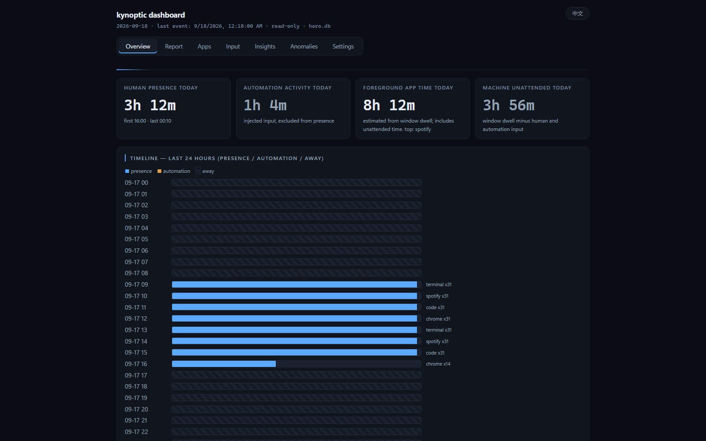

# Kynoptic

English | [简体中文](README.zh-CN.md)


A local-first activity awareness layer for Windows. Kynoptic records which
applications you use, when your machine is busy, what changes on your system —
and lets you (or your AI assistant) ask questions about it later. Everything
stays on your machine.

It answers the questions you actually have after the fact: "What was that tool
I used last Tuesday?", "Why was my laptop hot at 2pm?", "How much time did I
actually spend in the editor this week?" — through a CLI, a local dashboard,
or MCP.

  

- Website: <https://kynoptic.com>
- Status: v0.1, in active development. API surface may still change.

## Computer activity ≠ human activity

A machine being busy is not the same as a person being present. Kynoptic keeps
the two apart instead of blending them into one "activity" number: input events
flagged by Windows as injected (LLKHF_INJECTED — sent by scripts, macros, or AI
agents) are filtered out of the human metric and counted separately, so an
automation script hammering the keyboard never inflates your "time at the
computer".

The dashboard is built on three metrics:

- **Human presence** — minutes with real (non-injected) keyboard/mouse input.
- **Automation** — minutes where the only input was injected (scripts, agents).
- **Foreground dwell** — minutes an application held the foreground window,
  regardless of input.

Comparing them answers the question raw activity logs can't: was *someone*
there? The overview card does exactly that arithmetic:



> Example from a real day: foreground dwell **20h 1m** vs human presence
> **10h 14m** → **9h 39m** of "unattended" foreground time — hours the machine
> looked busy while no human was interacting with it (builds, sync jobs,
> idle-logged-in apps). Raw activity counters would have reported all of it as
> "usage"; Kynoptic shows you which part was a person.

## How it works

- **40 monitors** cover the system: foreground window and app switches,
  keyboard/mouse activity counts, idle time, battery, network interfaces,
  devices, processes, audio, brightness, Wi-Fi and more. **14 are enabled by
  default** (pure Win32 APIs, zero subprocesses); 26 more (browser tabs,
  clipboard, Bluetooth, and others) ship in the binary and are opt-in.
- **Raw events are stored untouched** in SQLite on your machine. Aggregate
  tables (per-minute/per-day buckets) exist only as derived read caches for
  fast queries; the raw layer is never truncated, re-keyed, or cleaned up
  automatically.
- **Query locally**: a CLI for ad-hoc questions, and an MCP server so a local
  AI assistant can ask for your day's summary, timeline, or anomalies without
  any data leaving the machine.

## Quick start

**Option 1 — Installer (recommended, under 1 minute, no toolchain):**

Download [Kynoptic-Setup.exe](https://github.com/ardss/kynoptic/releases/latest)
from the latest release, run it, and launch Kynoptic from the Start menu.
Collection starts automatically and the dashboard opens at
`http://127.0.0.1:8422` in your browser (if 8422 is taken, the dashboard
falls back to the next free port and records it in
`data\dashboard-port.txt`).

**Option 2 — Build from source:**

Requirements: Windows 10/11 and a Rust toolchain (stable, MSVC target).

```bash
git clone https://github.com/ardss/kynoptic
cd kynoptic
cargo build --release -p kynoptic

# collect (background, writes to <exe-dir>\data\kynoptic.db by default)
target\release\kynoptic.exe collect             # foreground collection; tray is the normal entry

# query what was recorded
target\release\kynoptic.exe query --from today
target\release\kynoptic.exe stats --days 7
target\release\kynoptic.exe dashboard          # local-only web panel (127.0.0.1)
```

### Use it from your AI assistant (MCP)

Kynoptic ships an MCP server (stdio JSON-RPC) with six tools:
`get_current_status`, `get_summary`, `get_timeline`, `get_top_apps`,
`get_anomalies`, `wait_for`. Point your MCP client at it:

```json
{
  "mcpServers": {
    "kynoptic": { "command": "kynoptic", "args": ["mcp"] }
  }
}
```

To point the MCP server at a specific database, set the `KYNOPTIC_DB`
environment variable (the MCP config `env` field works well):

```json
{
  "mcpServers": {
    "kynoptic": {
      "command": "kynoptic",
      "args": ["mcp"],
      "env": { "KYNOPTIC_DB": "D:/data/kynoptic.db" }
    }
  }
}
```

Both `--db <PATH>` and the `KYNOPTIC_DB` environment variable work — `mcp
--db` is passed to the server internally via `KYNOPTIC_DB`:

```json
{
  "mcpServers": {
    "kynoptic": { "command": "kynoptic", "args": ["mcp", "--db", "D:/data/kynoptic.db"] }
  }
}
```

Your assistant can then answer questions like "what was I doing when the CPU
spiked yesterday?" or "which app did I use most last Tuesday?" without the
data ever leaving your disk.

Threat model: any local program that can spawn processes (or is granted MCP
access by your assistant) can read your activity database with the same
rights as this MCP server — treat MCP access like plain file read access to
`KYNOPTIC_DB`. The server opens the database read-only and never sends data
off-machine, but it cannot protect the file from other local processes.

## Performance

Measured on a Ryzen 5 5600X / Windows 11, reproducible from the benchmark
harness in this repo (full methodology and raw numbers in
[BENCHMARKS.md](BENCHMARKS.md)):

| Metric | Measured |
|---|---|
| Idle CPU (whole collector, default monitors) | 0.41% of one core (p95 1.56%) |
| Resident memory (steady state) | ~16.5 MB |
| Startup to first sample | ~238 ms (median) |
| Storage cost | 336 bytes/event in raw mode; the default minute-granularity input mode is ~2.3x smaller |
| Query p95 on a 1M-event database | < 50 ms for all tools (anomalies ~30 ms, via aggregate caches) |
| Large legacy database open (1M rows, backfill pending) | ~8 ms (backfill runs chunked in background) |

## Privacy

- Recorded data never leaves your machine by default. There is no account, no
  telemetry, no analytics, no network calls except the user-invoked kynoptic update (GitHub).
- **Keyboard and mouse are stored as per-minute counts only — never key
  contents, key order, or timing.** The dashboard keyboard heatmap uses
  per-key frequency counts (how many times each key was pressed), which are
  aggregate statistics, not content. Per-key frequency is **on by default**
  (local data completeness first) and can be disabled explicitly in settings
  as an opt-out. Export writes `window_title` verbatim by default; pass
  `--redact` to strip URL query strings from titles. Privacy hardening is
  always available as a switch, but never at the cost of silently dropping
  local data — if you share exports outside the machine, you own the risk.
- Aggregates are derived caches; the raw event log is append-only.
- Deleting anything is opt-in and off by default; schema migrations archive
  tables by renaming instead of dropping.

The trade-off is deliberate: Kynoptic is useful precisely because the data is
complete, and it is trustworthy precisely because it is local.

## Repository layout

| Crate | Purpose |
|---|---|
| `crates/core` | Collectors, event pipeline, SQLite storage, queries |
| `crates/cli` | `kynoptic` / `kynoptic-ctl` CLI |
| `crates/dash` | Dashboard service and pages (shared by CLI and tray) |
| `crates/mcp` | MCP server (stdio) |
| `crates/tray` | Tray shell (pure Win32, hosts the collector and dashboard) |

Monitor registry (single source of truth for what is enabled by default):
`crates/core/src/registry.rs`. Extended app-internal docs: [APP.md](APP.md),
design notes: [CODE_NOTES.md](CODE_NOTES.md).

## License

Apache-2.0. See [LICENSE](LICENSE).
